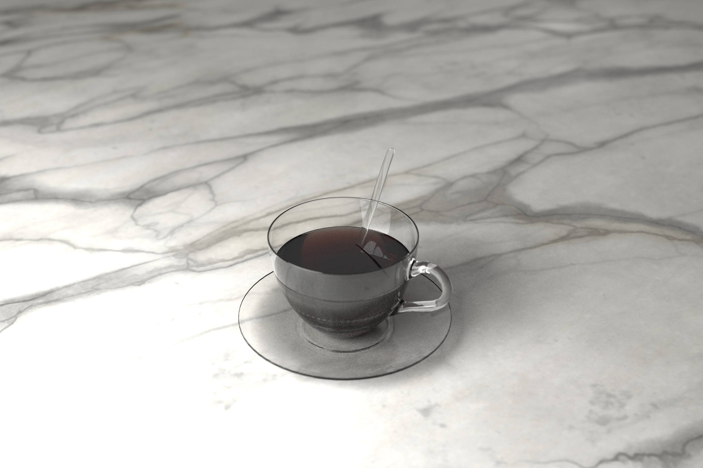
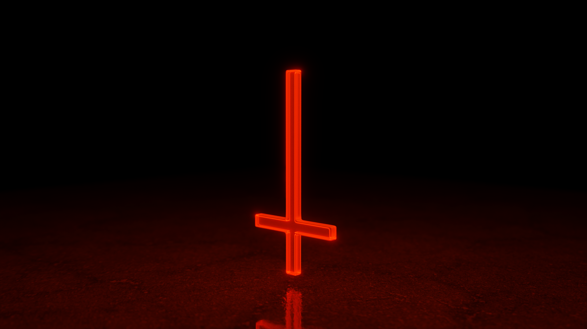
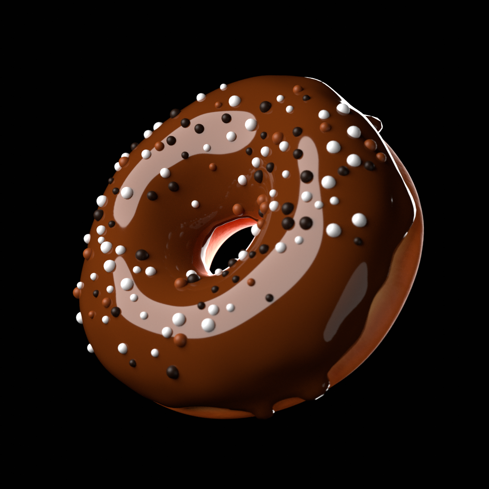

# Blender Learning Projects

This repository contains various Blender projects that I created while learning Blender. Each project is contained in a separate subdirectory and includes a Blender file (.blend) as well as any associated assets used in the project.

## Projects List

-   [Anvil](###Anvil)
-   [Bulb](###Bulb)
-   [Chair](###Chair)
-   [Coffee Cup](###Cup)
-   [Inverted Cross](###Cross)
-   [Donut](###Donut)

## Project Descriptions

Below are the descriptions of each project with accompanying images as suitable.

### Anvil

Anvil was a project that allowed me to learn how to use the boolean modifier and how to bake normal maps from a high poly model to a low poly model. I created a low poly model of an anvil and duplicated it to create a high poly model. After sculpting the high poly model to add more details, I baked a normal map to the low poly model.

### Bulb

The Bulb project helped me learn how to create different types of materials in Blender. I created materials like glass, metal, plastic, wood, and applied them to the bulb model.

### Chair

The Chair project helped me learn hard surface modeling and basic camera motion and animation. I created a chair model and added different textures to it to make it look more realistic.

### Cup

The Cup project was created to learn how to create a material with a transparent background. I used a node editor to create a material and added a texture to it. The model also has materials for liquid without actually simulating the liquid.

### Cross

The Cross project was created for a music video for an artist. It showcases camera motion and animation along with emission materials, transparency, and particle systems. It also showcases graph editor animation and driver animations.

### Donut

The Donut project was the introductory project to Blender. I created a donut model to learn the basics of Blender and to get familiar with the interface and all the basic tools and features of Blender.

## Usage

Each project is contained in a separate subdirectory. Each subdirectory contains a Blender file (.blend) as well as any associated assets used in the project. To open a project, simply open the .blend file in Blender.

## License

This project is licensed under the MIT License - see the [LICENSE](./LICENSE) file for details. 
Feel free to modify and use any of these projects for your own purposes, but please credit the original author if you share or distribute any modified versions of these projects.

## Author

All the projects in this repository were created by **Ali Qadir**. I am a Game Developer and a Blender enthusiast. You can find me on [LinkedIn](https://www.linkedin.com/in/ali-qadir-1509b1226/) and [Instagram](https://www.instagram.com/oily.oli/). 
